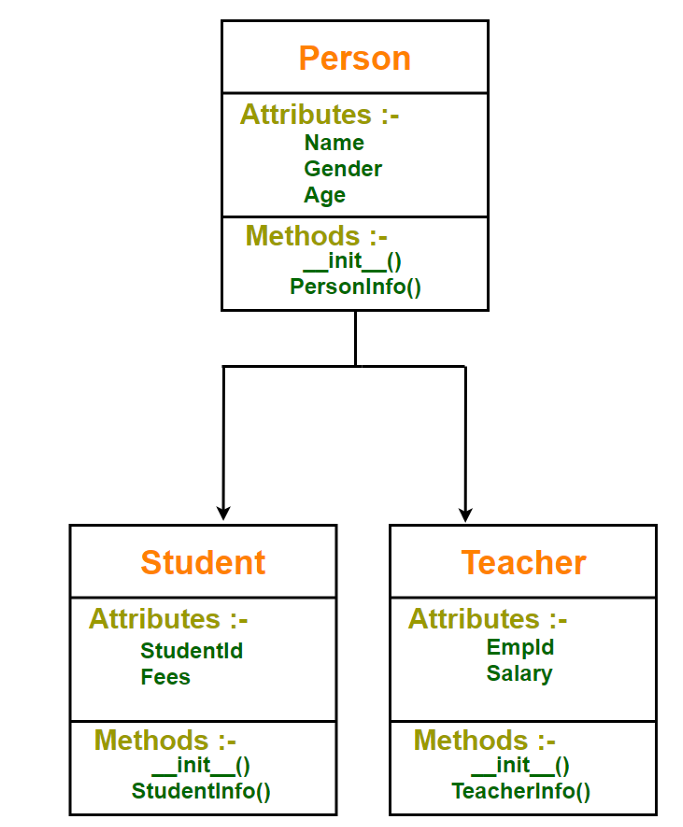

# Herança
A herança é fundamental na construção de hierarquias de classes, permitindo a criação de estruturas de código eficientes e organizadas. Ela promove a reutilização de código e facilita a manutenção do sistema.
    - Herança é uma característica poderosa na programação orientada a objetos.
    - Ela fornece reutilização de código no programa porque podemos usar uma classe existente (Super Classe / Classe Pai / Classe Base) para criar uma nova classe (Sub Classe / Classe Filha / Classe Derivada) em vez de criá-la do zero.
    - A classe filha herda definições de dados e métodos da classe pai, o que facilita a reutilização de funcionalidades já disponíveis.
    - A classe filha pode adicionar algumas definições adicionais ou redefinir um método da classe base.
    - A herança entra em cena quando uma nova classe possui o relacionamento 'É UM' com uma classe existente.
    - Por exemplo, um estudante é uma pessoa. Portanto, pessoa é a classe base e estudante é a classe derivada

    

## Herança Multinível
- Neste tipo de herança, uma classe pode herdar de uma classe filha ou classe derivada.
- A Herança Multinível pode ter qualquer profundidade em Python.

## Herança Múltipla
- A herança múltipla é uma característica na qual uma classe (classe derivada) pode herdar atributos e métodos de mais de uma classe pai.
- A classe derivada herda todas as características do caso base.

## Sobrescrita de Método
- A sobrescrita de método é uma parte muito importante da programação orientada a objetos, pois permite que a herança explore todo o seu poder.
- Sobrescrever é a capacidade de uma classe (Sub Classe / Classe Filha / Classe Derivada) alterar a implementação de um método fornecido por uma de suas classes pai.
- Quando um método em uma subclasse tem o mesmo nome, os mesmos parâmetros e o mesmo tipo de retorno que um método em sua superclasse, então o método na subclasse é dito sobrescrever o método na superclasse.
- A versão de um método que será executada será determinada pelo objeto que é usado para invocá-lo.
- Se um objeto de uma classe pai for usado para invocar o método, então a versão na classe pai será executada, mas se um objeto da subclasse for usado para invocar o método, então a versão na classe filha será executada.